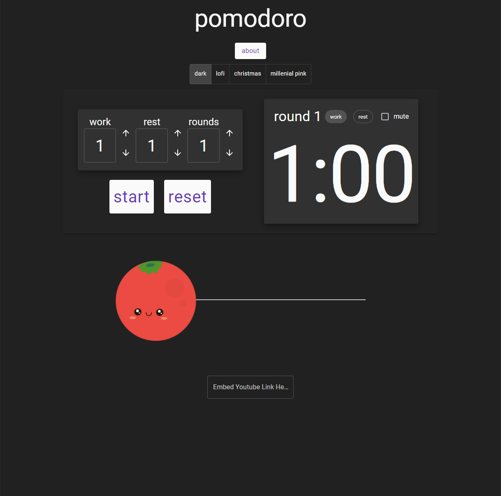

# **Pomodoro**
### React App created for making custom Pomodoro timers to study or work with.
[Link to Webpage](https://super-cool-site-by-saltedtofu.netlify.app/)
## Table of Contents
  - [Introduction](#introduction)
  - [Technologies](#technologies)
  - [Features](#features)
  - [Screenshots](#screenshots)
  - [Room for Improvement](#room-for-improvement)
  - [Contact](#contact)
## Introduction
  Pomodoro (Italian for tomato) is a study technique that takes advantage of switching between work periods and break periods to maximize focus and minimize distractions. This is a custom Pomodoro timer that allows the user to customize their work timer, rest timer, total number of rounds, as well as the overall theme of the webpage. It also includes an SVG progress bar element that moves a character across the screen to represent the total percentage completion of all rounds. Lastly the user is able to paste a youtube URL to embed a video to play while studying.
## Technologies
 - React.js
 - Redux
 - HTML
 - CSS
 - JS
 - Material UI
## Features
- Utilizes React.js (create-react-app) functional components with hooks.
- Redux is used for global state management
- React hooks (useState) used for state needed in only one component, as well as useEffect for conditional renders
## Screenshots
 - default dark theme

 - progress bar and youtube embed

## Room for Improvement
- Currently to restart the timer, the webpage needs to be refreshed entirely. I would like to add functionality so the user can stay in the same theme when refreshing.
- Additional themes
- Choose your character rather than automatic based on the theme
## Contact
- Tdansby7@gmail.com
- [LinkedIn](https://www.linkedin.com/in/tyler-dansby-rd-39541916b)